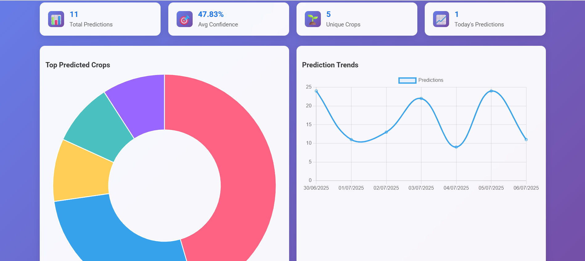

# CropML 🌱

A machine learning-powered crop recommendation system that helps farmers and agricultural professionals make informed decisions about crop selection based on environmental and soil conditions.

## 🌟 Features

- **Intelligent Crop Prediction**: ML model trained on comprehensive agricultural data
- **Comprehensive Crop Database**: Detailed information for 22 different crops
- **User-Friendly Web Interface**: Clean, responsive dashboard
- **Prediction History**: Track and manage your crop recommendations
- **Crop Information Hub**: Detailed growing guides and nutritional information
- **Export Functionality**: Download prediction history as CSV
- **RESTful API**: Programmatic access to prediction services

## 🚀 Live Demo

The application is deployed and available at: [CropML App](https://cropml.onrender.com)

## 🖼️ Screenshots

### 1. Home Page – Crop Recommendation Form

*The main interface where users input soil and climate data to get crop recommendations.*

### 2. Crop Recommendation Result

*Displays the recommended crop, confidence score, and detailed crop information.*

### 3. Dashboard – Analytics

*Visualizes prediction statistics, top crops, and trends.*

### 4. Crop Information Database

*Browse detailed information about all supported crops.*

### 5. Prediction History

*View, filter, and export your past crop predictions.*

## 🛠️ Technology Stack

- **Backend**: Flask (Python)
- **Machine Learning**: Scikit-learn, Random Forest Classifier
- **Database**: SQLite
- **Frontend**: HTML, CSS, JavaScript
- **Deployment**: Render
- **Data Processing**: Pandas, NumPy

## 📊 Supported Crops

The system supports 22 different crops including:

**Grains & Cereals:**
- Rice, Maize

**Legumes:**
- Chickpea, Kidney Beans, Pigeon Peas, Moth Beans, Mung Bean, Black Gram, Lentil

**Fruits:**
- Pomegranate, Banana, Mango, Grapes, Watermelon, Muskmelon, Apple, Orange, Papaya, Coconut

**Other Crops:**
- Cotton, Jute, Coffee

## 🏗️ Project Structure

```
CropML/
├── app.py                 # Main Flask application
├── train_model.py         # ML model training script
├── requirements.txt       # Python dependencies
├── render.yaml           # Deployment configuration
├── model.pkl            # Trained ML model
├── scaler.pkl           # Feature scaler
├── label_encoder.pkl    # Label encoder
├── features.pkl         # Feature names
├── Crop_recommendation1.csv  # Training dataset
├── crop_predictions.db  # SQLite database
├── static/              # Static assets
│   ├── images/         # Crop images
│   └── *.css          # Stylesheets
└── templates/          # HTML templates
    ├── index.html
    ├── dashboard.html
    ├── crop_info.html
    └── history.html
```

## 🚀 Installation & Setup

### Prerequisites

- Python 3.8 or higher
- pip (Python package installer)

### Local Development

1. **Clone the repository**
   ```bash
   git clone <repository-url>
   cd CropML
   ```

2. **Install dependencies**
   ```bash
   pip install -r requirements.txt
   ```

3. **Train the model** (if needed)
   ```bash
   python train_model.py
   ```

4. **Run the application**
   ```bash
   python app.py
   ```

5. **Access the application**
   Open your browser and navigate to `http://localhost:5000`

## 📖 Usage

### Web Interface

1. **Home Page**: Navigate to the main dashboard
2. **Crop Prediction**: Enter soil and environmental parameters
3. **View Results**: Get crop recommendations with confidence scores
4. **Crop Information**: Access detailed growing guides
5. **History**: Review and manage past predictions

### Input Parameters

The system requires the following parameters for crop prediction:

- **Nitrogen (N)**: Soil nitrogen content (0-140 kg/ha)
- **Phosphorus (P)**: Soil phosphorus content (5-145 kg/ha)
- **Potassium (K)**: Soil potassium content (5-205 kg/ha)
- **Temperature**: Average temperature (°C)
- **Humidity**: Relative humidity (%)
- **pH**: Soil pH level (3.5-10)
- **Rainfall**: Annual rainfall (mm)

## 🔌 API Documentation

### Endpoints

#### 1. Crop Prediction
```http
POST /crop-prediction
Content-Type: application/json

{
  "N": 90,
  "P": 42,
  "K": 43,
  "temperature": 20.879744,
  "humidity": 82.002744,
  "ph": 6.502985,
  "rainfall": 202.935536
}
```

**Response:**
```json
{
  "prediction": "rice",
  "confidence": 0.85,
  "recommendations": ["rice", "maize", "chickpea"],
  "timestamp": "2024-01-15T10:30:00Z"
}
```

#### 2. Get Prediction History
```http
GET /api/predictions
```

#### 3. Get Crop Information
```http
GET /api/crop-info/{crop_name}
```

#### 4. Export Predictions
```http
GET /export-predictions
```

#### 5. Application Statistics
```http
GET /api/stats
```

## 🤖 Machine Learning Model

### Model Details

- **Algorithm**: Random Forest Classifier
- **Features**: 7 environmental and soil parameters
- **Training Data**: 2200+ samples across 22 crop types
- **Accuracy**: ~95% on test set
- **Cross-validation**: 5-fold CV with balanced accuracy

### Model Training

The model is trained using the `train_model.py` script:

```bash
python train_model.py
```

This script:
1. Loads the training dataset
2. Preprocesses features using MinMaxScaler
3. Encodes target labels
4. Trains a Random Forest model
5. Saves the trained model and preprocessing components

## 🚀 Deployment

### Render Deployment

The application is configured for deployment on Render:

1. **Build Command**: `pip install -r requirements.txt`
2. **Start Command**: `python app.py`
3. **Python Version**: 3.10

### Environment Variables

Set the following environment variables for production:

```bash
SECRET_KEY=your-secret-key-here
FLASK_ENV=production
```

## 📊 Database Schema

The application uses SQLite to store prediction history:

```sql
CREATE TABLE predictions (
    id TEXT PRIMARY KEY,
    N REAL,
    P REAL,
    K REAL,
    temperature REAL,
    humidity REAL,
    ph REAL,
    rainfall REAL,
    prediction TEXT,
    confidence REAL,
    timestamp DATETIME
);
```

## 🧪 Testing

### Health Check
```http
GET /health
```

### Debug Model
```http
GET /debug/model
```

### Test Predictions
```http
GET /test/predictions
```

## 🤝 Contributing

1. Fork the repository
2. Create a feature branch (`git checkout -b feature/amazing-feature`)
3. Commit your changes (`git commit -m 'Add amazing feature'`)
4. Push to the branch (`git push origin feature/amazing-feature`)
5. Open a Pull Request

## 📝 License

This project is licensed under the MIT License - see the LICENSE file for details.

## 🙏 Acknowledgments

- Dataset: Crop Recommendation Dataset
- Icons: Various open-source icon libraries
- Deployment: Render platform

## 📞 Support

For support and questions:
- Create an issue in the repository
- Contact the development team

---

**CropML** - Empowering farmers with AI-driven crop recommendations 🌾